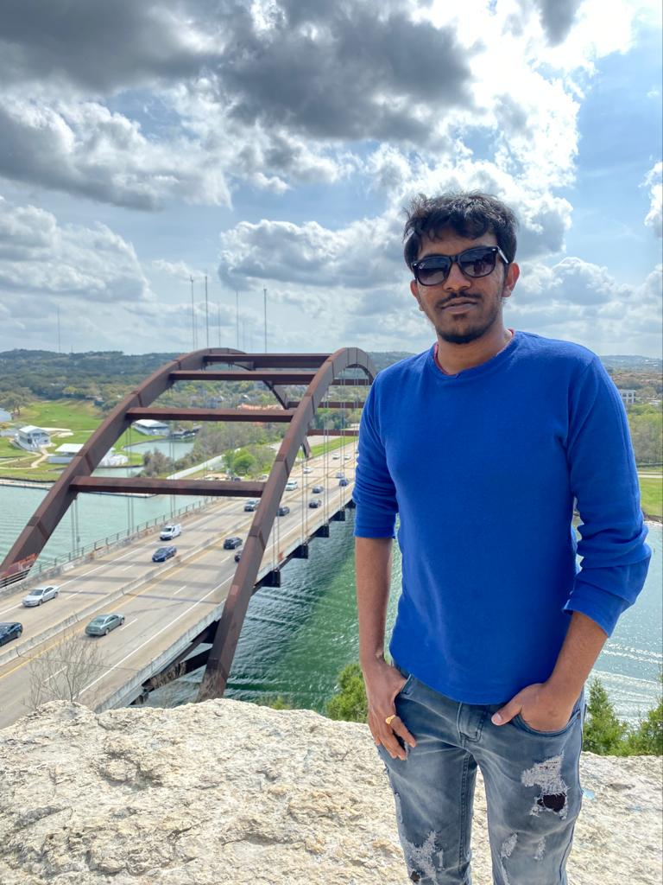

# Omkar Abhiteja Badda

## Current

 I have started my masters in Fall2019 in the stream of Applied Computer Science and pursuing my final semester here at Northwest Missouri State University.

## Background
My native place is Hyderabad which is in India where I have completed all my education till bachelor's degree and then started working as a Software Quality Analyst at Ebix.
My hobbies are playing cricket and watching movies.

## Plans
I want to become a Dev-Ops engineer and working towards attaining it.

## Links

###
[LinkedIn](https://www.linkedin.com/in/omkar-abhiteja-badda-661866180/)
[GitHub](https://github.com/abhiteja29)

[Shell-Data-Processing](https://github.com/abhiteja29/shell-data-processing)
## My Image:

